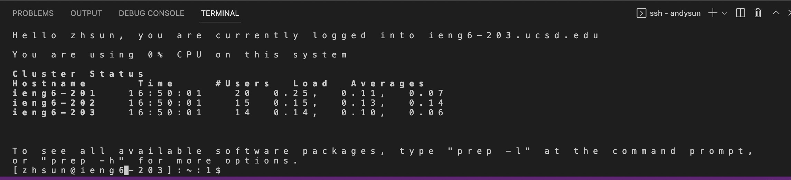

# CSE 15L Week 1 Lab Report 1

---

## Step 1: Installing VSCode
* Go to the [Visual Studio Website](https://code.visualstudio.com/) and install VSCode

* This is what looks like when open up VSCode


---

## Step 2: Remotely Connecting
1. Open a new terminal in VSCode (Using Terminal--> New Terminal Menu Option)

2. Type in the command `$ ssh cs15lfa22zz@ieng6.ucsd.edu`  and replace zz with the letter in the course specific account (Be careful not to type in the dollar sign)

3. If it is the first time logging in to the server it is likely that this message will pop up

```
⤇ ssh cs15lfa22zz@ieng6.ucsd.edu
The authenticity of host 'ieng6.ucsd.edu (128.54.70.227)' can't be established.
RSA key fingerprint is SHA256:ksruYwhnYH+sySHnHAtLUHngrPEyZTDl/1x99wUQcec.
Are you sure you want to continue connecting (yes/no/[fingerprint])? 
```

4. Type in yes and press enter, then type in the password. Once logged in this message will pop up:

```
# Now on remote server
Last login: Sun Jan  2 14:03:05 2022 from 107-217-10-235.lightspeed.sndgca.sbcglobal.net
quota: No filesystem specified.
Hello cs15lfa22zz, you are currently logged into ieng6-203.ucsd.edu

You are using 0% CPU on this system

Cluster Status 
Hostname     Time    #Users  Load  Averages  
ieng6-201   23:25:01   0  0.08,  0.17,  0.11
ieng6-202   23:25:01   1  0.09,  0.15,  0.11
ieng6-203   23:25:01   1  0.08,  0.15,  0.11

Sun Jan 02, 2022 11:28pm - Prepping cs15lfa22
```

5. Now the computer is connected to a computer at CSE Basement, this is what looks like when the local computer is successfully connected to a server:



---

## Step 3: Trying Some Commands
* Try running some commands


* This is an exmaple when running command `cat /home/linux/ieng6/cs15lfa22/public/hello.txt`


---

## Step 4: Moving Files with `scp`
1. Create a file on the local computer called `WhereAmI.java` and put in these cods

```
class WhereAmI {
  public static void main(String[] args) {
    System.out.println(System.getProperty("os.name"));
    System.out.println(System.getProperty("user.name"));
    System.out.println(System.getProperty("user.home"));
    System.out.println(System.getProperty("user.dir"));
  }
}
```

2. In the terminal, type in this command: `scp WhereAmI.java cs15lfa22zz@ieng6.ucsd.edu:~/`

3. Type in the password and log in to the remote server

4. Run the program in the ieng6 compyter using `javac` and `java` commands


* This is what looks like when I finish running the program on ieng6 computer

---

## Step 5: Setting an SSH Key
1. Type in the command `ssh-keygen` into the terminal (After doing this, we no longer need passwords to log into the server)


* When giving the message `Enter file in which to save the key`, press enter to go to the default pass
* The first step will create two files on the system. One is the private key and the other is the public key that are stored in the `.ssh` directory in the computer

2. Copy the public key to the directory using the following commands

```
#on client 
$ ssh cs15lfa22zz@ieng6.ucsd.edu
```

```
#on server
$ mkdir .ssh
```


* This shows that you succesfully set up the ssh keys


* Now you no longer need password when logging in the server!

---

## Step 6: Optimizing Remote Running
* We can use command in a quote at the end of an `ssh` command to run the server directly after logging in


* We can also use semi colons to run multiple commands at the same time


* Up arrow on the keyboard can recall the last command we typed in


