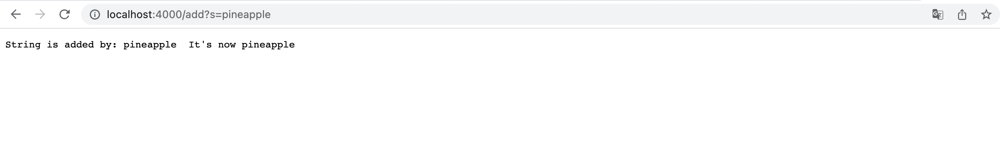
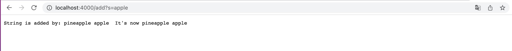

# CSE15L Week 3 Lab Report
## Part 1:
* This is my code for Simplest Search Engine
```
import java.io.IOException;
import java.net.URI;

class Handler implements URLHandler {
    // The one bit of state on the server: a number that will be manipulated by
    // various requests.
    String str = "";

    public String handleRequest(URI url) {
        if (url.getPath().equals("/")) {
            return "String: " + str;
        } 
        else {
            System.out.println("Path: " + url.getPath());
            if (url.getPath().contains("/add")) {
                String[] parameters = url.getQuery().split("=");
                if (parameters[0].equals("s")){
                    str += parameters[1] + " ";
                    return "String is added by: " + str + " It's now " + str;
                }
            }
            else if (url.getPath().contains("/search")){
                String[] answer = str.split(" ");
                String[] parameters = url.getQuery().split("=");
                String output = "";
                for(int i = 0; i < answer.length; i ++){
                    if(answer[i].contains(parameters[1])){
                        output += answer[i] + " ";
                    }
                }
                return output;
            }
            return "404 Not Found!";
        }
    }
}

class SearchEngine {
    public static void main(String[] args) throws IOException {
        if(args.length == 0){
            System.out.println("Missing port number! Try any number between 1024 to 49151");
            return;
        }

        int port = Integer.parseInt(args[0]);

        Server.start(port, new Handler());
    }
}
```
1. First I want to try using the command `/add?s=pineapple` (we are using this command to add pinapple)

* We can see that whe we type in `/add?s=pineapple` we are calling the method `handleRequest`
* Since the URL contains "/add", we fullfill the if statement and split the url by "=" and put them into a String array
* Then we detect that the 0 index of the String array is s, then we put index 1 which is the content we want into a empty String and return it

2. Next Let's try the command `/add?s=apple` (we are using this command to add apple)

* Same as the command above, we are calling the method `handleRequest`
* Since the URL contains "/add", we fullfill the if statement and split the url by "=" and put them into a String array
* Then we detect that the 0 index of the String array is s, then we put index 1 which is the content we want into the String *str*
* Since there is a string pinapple already in *str*, the output will be "pinneapple apple"

3. Finally try using the command `/search?s=app` (we are using the command to find the contents we added that contains app in it)

