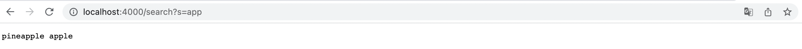
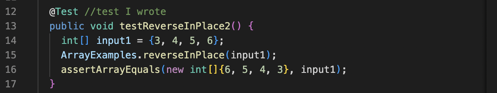
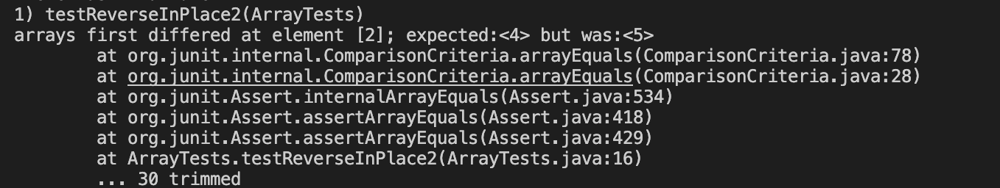
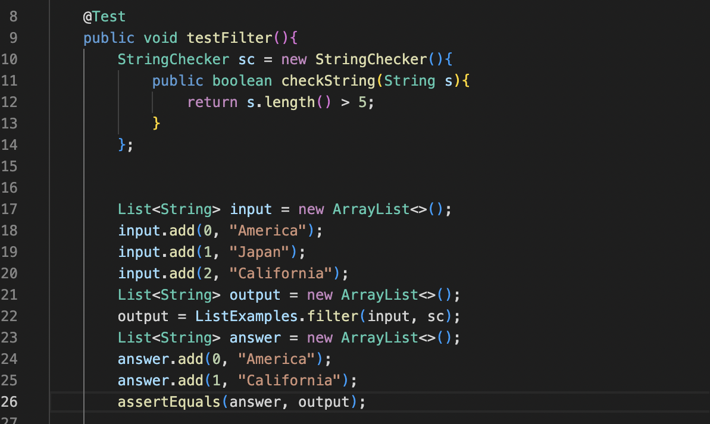
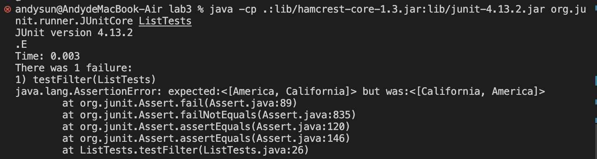

# CSE15L Week 3 Lab Report
## Part 1:
* This is my code for Simplest Search Engine
```
import java.io.IOException;
import java.net.URI;

class Handler implements URLHandler {
    // The one bit of state on the server: a number that will be manipulated by
    // various requests.
    String str = "";

    public String handleRequest(URI url) {
        if (url.getPath().equals("/")) {
            return "String: " + str;
        } 
        else {
            System.out.println("Path: " + url.getPath());
            if (url.getPath().contains("/add")) {
                String[] parameters = url.getQuery().split("=");
                if (parameters[0].equals("s")){
                    str += parameters[1] + " ";
                    return "String is added by: " + str + " It's now " + str;
                }
            }
            else if (url.getPath().contains("/search")){
                String[] answer = str.split(" ");
                String[] parameters = url.getQuery().split("=");
                String output = "";
                for(int i = 0; i < answer.length; i ++){
                    if(answer[i].contains(parameters[1])){
                        output += answer[i] + " ";
                    }
                }
                return output;
            }
            return "404 Not Found!";
        }
    }
}

class SearchEngine {
    public static void main(String[] args) throws IOException {
        if(args.length == 0){
            System.out.println("Missing port number! Try any number between 1024 to 49151");
            return;
        }

        int port = Integer.parseInt(args[0]);

        Server.start(port, new Handler());
    }
}
```
1. First Let's try just using the command `/`

3. First I want to try using the command `/add?s=pineapple` (we are using this command to add pinapple)

* We can see that whe we type in `/add?s=pineapple` we are calling the method `handleRequest`
* Since the URL contains "/add", we fullfill the if statement and split the url by "=" and put them into a String array
* Then we detect that the 0 index of the String array is s, then we put index 1 which is the content we want into a empty String and return it

2. Next Let's try the command `/add?s=apple` (we are using this command to add apple)

* Same as the command above, we are calling the method `handleRequest`
* Since the URL contains "/add", we fullfill the if statement and split the url by "=" and put them into a String array
* Then we detect that the 0 index of the String array is s, then we put index 1 which is the content we want into the String *str*
* Since there is a string pinapple already in *str*, the output will be "pinneapple apple"

3. Finally try using the command `/search?s=app` (we are using the command to find the contents we added that contains app in it)

* In this command, we are also calling the method `handleRequest`
* Since the URL contains "/search', we fullfill the else statement
* Then I create a new String array called *answer* which contains the contents in *str* and split by space between the contents
* After that I also split the URL by "=" and put them into a String array called *parameters*
* The I use a for loop to find all the elements in the *answer* array that if any of them matches the inde 1 of parameter array
* For every matched element, I add it into a new empty String called output
* Finally return the output

---

## Part 2
* The first bug I found is *reverseInPlace* method in the file *ArrayExamples.java*
1. Failure-inducting input:

2. Symptom:

3. The bug:
```
static void reverseInPlace(int[] arr) {
    for(int i = 0; i < arr.length; i += 1) {
      arr[i] = arr[arr.length - i - 1];
    }
  }
```
* We can see from the above code that, the code is reversing in the exact same array as the input so it will doing well until the middle index of the array, for exmaple the length of the array is 4, when the for loop coming to index 2, we can find out that when we trying to change index 2 with the value in index 1, index 1 has been changed to the value of index 2 in the last operation of the loop. 
```
static void reverseInPlace(int[] arr) {
    int[] answer = new int[arr.length];
    int index = 0;
    for(int i = arr.length - 1; i >=0; i --){
      answer[index] = arr[i];
      index ++;
    }
    for(int i = 0; i < answer.length; i ++){
      arr[i] = answer[i];
    }
  }
``` 
* This is what the code looks like after I fixed it.

4. Connection between bug and symptom:
    * Since the bug will cause error in the middle index, we can see that the error in the test comes at index 2 which is exactly the middle index. The error message said the value in index 2 expected: <4>, but was actually <5>. This is because the value in index 1 is already being changed by the last operation of the loop and the value in the index 1 now is actually the original index 3 value which is 5.

* The second bug I choose is *filter* method in the file *ListExamples.java*
1. Faliure-inducting input:

2. Symptom: 

3. The bug:
```
static List<String> filter(List<String> list, StringChecker sc) {
    List<String> result = new ArrayList<>();
    for(String s: list) {
      if(sc.checkString(s)) {
        result.add(0, s);
      }
    }
    return result;
  }
```
* The problem for this code is that the order is messed up because the part that `result.add(0, s)` which will let the every new String being added to index 0.
```
static List<String> filter(List<String> list, StringChecker sc) {
    List<String> result = new ArrayList<>();
    int i = 0;
    for(String s: list) {
      if(sc.checkString(s)) {
        result.add(i, s);
        i ++;
      }
    }
    return result;
  }
```
* This is the code after I fixed it

4. The connection between bug and symptom:
    * I am adding the Strings "America" "Japan" and "California" into the string arraylist that I created, and I want to choose the string's length that is gretare than 5. So in the same order, the output should be <[America, California]> but was <[California, America]>. This is because the code `result.add(i, s);` in the method let "California" comes into index 0 which messed up the order.


